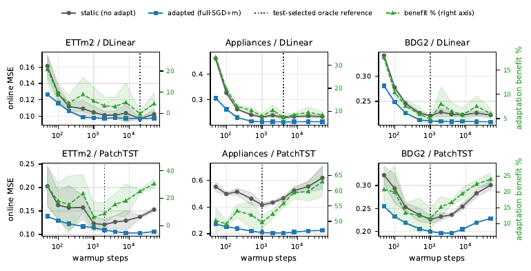
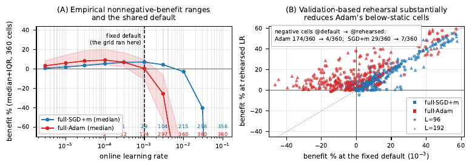
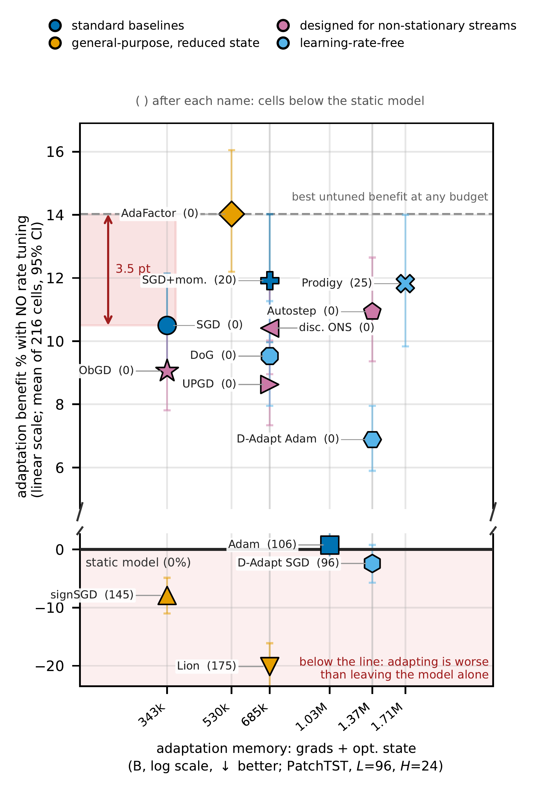
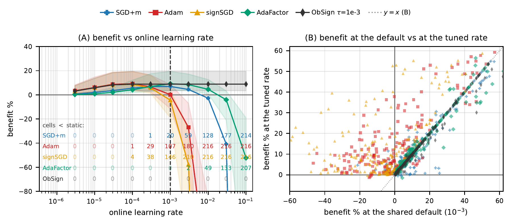

# When Does Online Adaptation Pay on the Edge?

Code, data and **every reported number** for *"When Does Online Adaptation Pay on the Edge?
A Leakage-Free Evaluation of Warmup, Learning-Rate Selection, and Resource Trade-offs for
Time-Series Forecasting"* (under review, IEEE BigData 2026;
preprint [arXiv:2609.01126](https://arxiv.org/abs/2609.01126)).

Six public multivariate streams (ETTh1/h2, ETTm1/m2, UCI Appliances, BDG2 smart meters),
two backbones (DLinear, compact PatchTST), a 360-cell design, 5 seeds.

## Findings

**The reported benefit of online adaptation is largely an artifact of three evaluation
choices.** We measure how large each one is, and give a selection procedure that removes it.

**1. The static baseline's warmup budget moves the answer by up to 18.8 pp — in both
directions.** An under-warmed baseline underfits, so adaptation gets credit for finishing base
training; an *over*-warmed baseline generalizes worse from the pre-drift segment to the drifted
test window, inflating the benefit again. The dependence is two-sided and non-monotone, so
"train the baseline longer" is not a fix. Over the 1,000–20,000-step range the estimated
benefit — a skill score with the static model as the reference forecast — moves by
3.0–18.8 pp across six dataset–backbone settings.



*Green (right axis) is the estimated adaptation benefit as the baseline's warmup budget varies.
It is non-monotone in every panel.*

**2. Comparing optimizers at one shared default rate reverses the verdict.** At the usual
`lr=1e-3`, Adam wins 45 of 360 cells and falls below the static baseline in 174 of them — the
familiar "SGD is safe, Adam over-adapts online" reading. Selecting each optimizer's online rate by
*rehearsing* adaptation on a held-out pre-drift slice (never test data) reverses this: Adam
wins **310 of 360** cells, with **4** below static. The original verdict measured rate
sensitivity, not optimizer quality.



*(A) each optimizer's benefit across the rate grid; the shared default sits where the two
curves happen to cross. (B) the same cells at the default vs. at the rehearsed rate.*

**3. Overlapping-window streaming leaks targets into the gradient** (known; DSOF, ActNow). We
use non-overlapping windows at stride = horizon and reproduce the inflation the leaky
alternative causes — up to +25.9 pp on ETTh2/PatchTST — against a delayed-adaptation control.

**Adaptation state, not accuracy, is the binding constraint on the edge.** On
Appliances/PatchTST, calibration-only Adam reaches +44.5% benefit using 204 KB of adaptation
state against full-model Adam's +52.5% at 1,028 KB: **5× less state for ~85% of the benefit**.
Several parameter-efficient variants are nondominated on the state-memory axis. We also show
that reported smart-meter gains depend on the meter-selection rule, so we fix it ex ante.

Together these support a **validation-only commissioning procedure**: the warmup budget and
the online rate are both selected on a pre-drift validation slice, before the device sees its
site. Target-device latency and energy remain to be measured; the compute axis here is
A100-measured.

## Reusable components

- **The protocol, as working code.** `online_eval.py` is self-contained: `stream_eval`
  (leakage-free streaming), `warm_and_select` (validation-selected warmup) and
  `select_online_lr` (rehearsal-based online-rate selection). They apply unchanged to another
  stream.
- **The sweep artifacts.** `grid.jsonl` (360 cells) and `lr_fairness.jsonl` (390 lines, each
  carrying a full 10-point online-LR sweep) are enough to re-derive our statistics or test a new
  hypothesis without a GPU. The BDG2 meter subsets are specified ex ante and shipped.

## Reproducibility

**No number in the paper is typed by hand.** Every one is a LaTeX macro generated from the
shipped artifacts, and every figure is drawn from them. Both regenerate in seconds without a
GPU; this is the first thing to run:

### Quickstart 1 — numbers and figures, without a GPU (seconds)

```bash
pip install -r requirements.txt
bash experiments/tsf_edge/data/get_data.sh   # download only, no GPU (see the note below)
python experiments/tsf_edge/gen_macros.py    # -> results/tsf_edge/macros.tex (842 macros)
python experiments/tsf_edge/paper_figs.py    # -> results/tsf_edge/*_paper.pdf (the paper's 5 figures + 1 supplementary)
```

`get_data.sh` is needed here even though this step uses no GPU: five of the 842 macros describe
the *composition* of the Appliances stream (`\ApplChannels` and friends) and are computed from
`appliances.csv` itself rather than from a result artifact. Without it `gen_macros.py` prints
`WARNING: dataset composition skipped` and emits 837 macros, four of which the paper references
— so `main.tex` would not compile. Every other macro comes from the shipped artifacts.

### Quickstart 2 — rerunning the experiments (GPU)

```bash
pip install -r requirements.txt
bash experiments/tsf_edge/data/get_data.sh   # fetch ETT x4 + UCI Appliances (bdg2*.csv shipped)
python experiments/tsf_edge/combined_grid.py # e.g. the 360-cell grid
```

## Layout

```
experiments/tsf_edge/    the harness (see "Reproduction map" below)
    data/                datasets: bdg2*.csv shipped; ETT + Appliances via get_data.sh
    online_optimizers.py the follow-up study's update rules, ObSign among them
    stage0_*.py          the follow-up study's harness, pooling and tables
results/tsf_edge/        both studies' result artifacts (data files + generated macros/figures)
    macros.tex           conference paper: every number, generated
    macros_ext.tex       follow-up study: every number, generated (\Ext... namespace)
    stage0*_optimizers*.jsonl   the follow-up study's cells
docs/figs/               the four README figures, rendered from the tracked *_paper.pdf
```

## Reproduction map (paper item -> script -> artifact)

| Paper item | Script | Artifact | Runtime (1x A100) |
|---|---|---|---|
| Fig. 1 + Table I (C1a warmup sensitivity, 2x3 panels) | `warmup_confound.py` | `warmup_confound_sgdm.json` | ~1.5 h |
| Fig. 2 (C1c validation-only selection, same 2x3 grid as Fig. 1) | `validation_protocol.py` | `validation_protocol_sgdm.json` | ~1.5 h |
| C1 leak-inflation numbers (the stride-1 alternative) | `leakage_check.py` | `leakage_check_sgdm.json` | ~10 min |
| Fig. 3 + Table II (C2 learning-rate selection: default / rehearsed / oracle readings) | `lr_fairness.py` (`--L/--H/--seeds`) | `lr_fairness.jsonl` (10-rate grid over the 360-cell design) | ~16 h total |
| C2 shared-default statistics at scale | `combined_grid.py` | `grid.jsonl` (360 cells) | ~13 h |
| C2 guard: are collapsed high rates a startup transient or a steady-state failure? | `lr_transient_check.py` | `lr_transient.json` | — |
| Fig. 4 (C3 accuracy--memory--compute frontier, 5 seeds) | `frontier_seeds.py` | `frontier_seeds.jsonl` (30 points x 5 seeds; `frontier_data.json` = the retired seed-0 run) | ~30 min |
| Per-update wall-clock (Fig. 4 compute axis) | `frontier_timing.py` | `frontier_timing.json` | ~2 min |
| Fig. 5 (staleness: one row of dataset panels, hue = optimizer, shade = schedule) | `staleness.py` / `staleness.py --strategy full_adam` | `staleness_patchtst_full_sgdm.json` / `staleness_patchtst_full_adam.json` | ~15 min each |
| Table III (BDG2 meter-selection & scale study) | `prep_bdg2_subsets.py`, then `lr_fairness.py --datasets bdg2_fox,bdg2_panther,bdg2_rat_worst,bdg2_rat_all,bdg2_fleet` | `bdg2_*.csv` + the 30 subset rows in `lr_fairness.jsonl` | ~40 min (15-meter subsets); hours for site/fleet |
| Per-update wall-clock vs channel count (the scale numbers in §IV-C) | `scale_timing.py` | `scale_timing_sgdm.json` | — |
| Supplementary: the warmup confound across four adaptation strategies (not in the paper — cut for page budget; figure `m6_strategies_paper.pdf`) | `m6_strategies.py` | `m6_strategies.json` (figure), `m6_strategies_sgdm.json` (macros) | ~2 h |
| Every number in the paper | `gen_macros.py` | `macros.tex` (842 macros) | seconds, no GPU |
| Every figure in the paper | `paper_figs.py` | `*_paper.pdf` | seconds, no GPU |

Runtimes are the measured wall-clock of the paper's runs on one A100; `—` = not recorded.

Two scripts are shipped but **superseded**, kept so the earlier readings stay reproducible:
`frontier.py` (single-seed C3 frontier, replaced by `frontier_seeds.py`) and `regime_figure.py`
(standalone C2 figure, replaced by `paper_figs.regime_paper`).

`grid.jsonl`: one JSON line per cell (6 datasets x 2 backbones x H in {24,48,96} x
L in {96,192} x 5 seeds = 360), with the validation-selected warmup, static/adapted results for
full-SGD and full-Adam, optimizer-state bytes, and the three optimizer-independent probes
(P1 noise, P2 gradient cosine, P3 drift; P3 is post hoc — it uses the test region).
`lr_fairness.jsonl`: 390 lines — the same 360-cell design plus 30 BDG2 meter-selection rows
(5 subsets x 2 backbones x 3 seeds at H=24, L=96) for Table III. Each line carries the full
10-point online-LR sweep (a `{1,3}x10^k` grid from `3e-6` to `1e-1`: validation-rehearsal MSE +
test MSE + benefit per rate, per optimizer) and the rehearsed / test-oracle readings.

## The follow-up study

*Under review; the paper's venue and title are not public and are not named here. Its numbers,
code and artifacts are — the section below is written from them.*

Its layer is the `stage0_*` scripts and result files. The two layers share the protocol, the
data and `online_eval.py`, and are otherwise independent: the conference layer's scripts import
nothing from the follow-up's.

### Findings

The follow-up study takes the third confound above — that optimizers are usually compared at
one rate inherited from one of them — and turns it into what a deployment imposes. **The rate
must be fixed once, before the site is seen**, because nobody is on the meter to tune it. Two more
constraints follow: the optimizer may carry almost no state per parameter, and adapting must
never end up worse than leaving the model frozen. That gives three requirements, and 23 update
rules are measured against them on 216 evaluation cells (6 datasets x 2 backbones x 6
horizon settings x 3 seeds).

**1. No existing design class satisfies all three at once.** At the shipped default
`lr=1e-3`, the ranking bears no relation to the tuned ranking: Adam averages **+0.75%** and
puts **106 of 216 cells (49%) below the frozen model** — negative skill, i.e. negative
transfer — with a worst case of −46.5%, while costing two values of state per parameter; Lion
averages **−20.14%** with 175 cells below and 4 divergent; SGD+m is
safer (+11.91%, 20 below) but plateaus. Rules designed for non-stationary streams are safe and
plateau lower; learning-rate-free rules are untuned by construction but not competitive.



*Adaptation benefit with no rate tuning, against adaptation state. `( )` after each name = cells
below the frozen model. The lower panel is where adapting is worse than not adapting.*

**2. One existing rule survives, and only at a single rate.** AdaFactor at its shipped
`lr=1e-3` reaches **+14.03%** with **0 of 216** cells below the frozen model at 0.54x the state
of SGD+m. But over a 10-rate grid spanning 4.5 decades of plausible shipped rates it is
deployable at **exactly 1** of them: one grid step in either direction disqualifies it. Adam is
deployable at 1 rate, SGD+m and Lion at 0. A rule that only works at the rate it happens to
ship with does not satisfy a requirement that the rate be fixed before the site is seen.

**3. Capping a sign step at a fixed fraction of each parameter's own RMS meets all three, with
zero optimizer state.** ObSign at τ=1e-3 reaches **+14.00%** at the shipped default — matching
AdaFactor and tuned Adam (+14.16%) — with **0 of 216 cells below the frozen model** (worst
**+0.2%**), **0 bytes** of optimizer state, and it stays deployable across **7 of the 10
candidate rates, a 3.0-decade stable learning-rate range** — while leaving no cell below the
frozen baseline at *any* rate on the grid. It is the only rule measured that is simultaneously
harmless everywhere and deployable somewhere.



*(A) benefit across the rate grid; the row of counts under each curve is cells below the frozen
model at that rate — ObSign's row is zero throughout. (B) benefit at the shared default vs. at
the tuned rate: ObSign sits on the diagonal, so the shared default costs it no accuracy.*

The mechanism is a cap that binds only above a threshold, not a heuristic. The effective step
is `min(lr, τ·RMS(p))`, and the rate at which the relative cap begins to bind — the *knee* —
separates two regimes: below it ObSign *is* signSGD, above it the rate cancels. That identity
is asserted in `test_online_optimizers.py` rather than argued in prose, and `run_stage0d.sh`
sweeps τ finely enough to locate the crossing below which no cell shows negative skill, rather
than picking a round number.

### Reusable components

- **Eight rules implemented here as drop-in `torch.optim.Optimizer`s**
  (`online_optimizers.py`) — the ones with no off-the-shelf implementation: ObSign and its
  RelSign ablation, the non-stationary-stream family (obGD, Ada-obGD, dONS, AutoStep), and the
  step-size-adaptation pair (IDBD, UPGD). They carry their own assertions in
  `test_online_optimizers.py`. These eight cover 13 of the 23 configurations
  (ObSign is swept at six values of τ); the remaining 10 come from torch, `lion-pytorch` and
  `pytorch-optimizer` through `online_eval.py`'s factory, so the whole comparison is a single
  dispatch table.
- **A deployability criterion applicable to a new rule**: benefit at a rate fixed before the
  data is seen, cells with negative skill, and state bytes — evaluated together by
  `stage0_pool.py`.
- **The 216-cell sweep itself**: every rule's full 10-rate response per cell, so a new rule can
  be placed against the 23 measured configurations without rerunning them.

### Regeneration

Same rule as the conference layer: **no number is typed by hand.** `gen_macros_stage0.py`
regenerates all of `macros_ext.tex` from the shipped `stage0*.jsonl`, and `stage0_figs.py`
regenerates the two tables and three figures.

```bash
pip install -r requirements.txt                              # includes the two extra deps
python experiments/tsf_edge/gen_macros_stage0.py             # -> results/tsf_edge/macros_ext.tex
python experiments/tsf_edge/stage0_pool.py                   # the pooled tables, as markdown
python experiments/tsf_edge/test_online_optimizers.py        # the update rules' own assertions
```

| Paper item | Script | Artifact | Runtime (1x A100) |
|---|---|---|---|
| the memory-light and learning-rate-free contenders | `stage0_optimizers.py --stage 0` (per `--L/--H` slice) | `stage0_optimizers.jsonl` (216 cells) | — |
| the rules built for non-stationary streams | `run_stage0b.sh` | `stage0b_optimizers.jsonl` | ~27 h |
| ObSign and its ablation | `run_stage0c.sh` | `stage0c_optimizers.jsonl` | ~10 h |
| bracketing fill-in (two top rates; a shared grid is only fair if it brackets every rule's optimum) | `run_stage0_fillin.sh` on two hosts, then `merge_stage0_fillin.py --write` | `stage0_fillin_*.jsonl` | — |
| seeds 3-4 for the leading rules (216 -> 360 cells) | `run_stage0_seeds.sh`, then `merge_stage0_seeds.py --write` | `stage0_seeds34*.jsonl` | — |
| the deployment (parameter-efficient) configurations | `run_g2_peft.sh` | `stage0_optimizers_{calib,head}.jsonl` | ~2.5 h |
| the guard level tau, swept finely enough to locate the no-harm crossing | `run_stage0d.sh` | `stage0d_optimizers.jsonl` | ~7.3 h |
| comparison with PETSA's modules and loss | `petsa_compare.py` (uses `petsa_calib.py`) | rows inside the PEFT artifacts | — |
| Table II (deployability at every shipped rate) | `stage0_figs.requirement_table()` | `requirement_table.tex` | seconds |
| Table III (all rules, both readings) | `stage0_figs.optimizer_table()` | `optimizer_table.tex` | seconds |
| Figs. 1-3 | `stage0_figs.{requirement_gap_paper,knee_paper,lr_response_paper}()` | `*_paper.pdf` | seconds |
| every number in the follow-up study | `gen_macros_stage0.py` | `macros_ext.tex` | seconds, no GPU |
| the palette's colour-blind separation | `check_palette.py` | printed report | seconds |

Runtimes are the measured wall-clock of the runs the paper reports, on one A100; `—` = not
recorded (the fill-in and seed passes ran split across two other hosts).

Reading the artifacts: one JSON line per cell, keyed by (dataset, backbone, L, H, seed), with
each rule's full sweep over the shared 10-rate grid (`{val, test, benefit}` per rate), the
validation-selected and test-oracle rates, and the measured optimizer-state bytes. The four
stage files are separate on purpose — every added run got a new prefix rather than rewriting the
previous artifact — and `stage0_pool.load_cells()` merges them per cell. `stage0_pool.py` is the
single implementation of every pooled statistic the paper quotes; the tables, the figures and
the macros all call it, so they cannot disagree.

## Environment

Python 3.11, and the versions pinned in `requirements.txt` (the ones used for the paper:
torch 2.7.0+cu126 on a single NVIDIA A100 80GB, CUDA 12.5). Nearby versions are expected to
work; exact numerical reproduction assumes the pinned versions and the shipped data files
(`experiments/tsf_edge/data/checksums.sha256`).

## Data

See `experiments/tsf_edge/data/README.md` for sources, licenses, and the BDG2 preprocessing
specification. `bdg2.csv` (a processed subset of the MIT-licensed Building Data Genome 2
corpus) is shipped; ETT and UCI Appliances are downloaded by `get_data.sh` and verified
against the checksums of the exact files used in the paper.

## License / citation

Code: MIT (see `LICENSE`). Datasets keep their original licenses (see the data README).

Citation: this repository accompanies the conference paper named above (under review, IEEE
BigData 2026; preprint: [arXiv:2609.01126](https://arxiv.org/abs/2609.01126)) and a follow-up
study whose paper is also under review and not yet public. Citation entries and links will be
added as the venues are decided. Until then, please cite the repository URL and the commit hash
you used.
